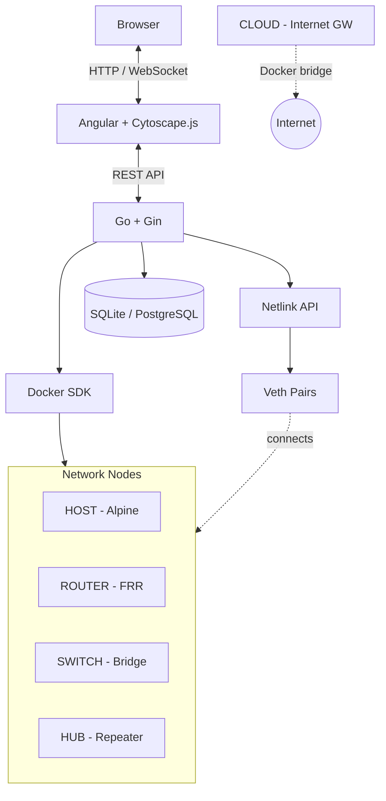

# OpenVeth

**OpenVeth** is a web-based network emulator that uses real Linux kernel networking (Namespaces, Veth pairs, Bridges) and Docker containers to create network topologies. Design, deploy, and interact with network nodes directly from your browser.


---

<p align="center">
  
</p>

<p align="center">
  <i>Create network topologies visually, connect to nodes via terminal, capture packets in real-time.</i>
</p>

---

### Broadcast & Collision Domain Overlay

Visualize **broadcast** and **collision** domains directly on the topology canvas with a single click.

<p align="center">
  
</p>
<p align="center"><i>Broadcast domains — each colored region is an independent broadcast domain separated by routers.</i></p>

<p align="center">
  
</p>
<p align="center"><i>Collision domains — note how the hub merges all connected ports into a single shared collision domain, while the switch isolates each link.</i></p>

---

### Visual Traceroute

Run traceroute from any node and watch the path light up on the graph in real-time.

<p align="center">
  
</p>
<p align="center"><i>Each hop is numbered on the canvas. The result table shows IP, RTT, and the resolved node name.</i></p>

<p align="center">
  
</p>

---

## Features

| Feature | Description |
|---------|-------------|
| **Visual Topology Builder** | Drag-and-drop canvas (Cytoscape.js) to design network labs |
| **Integrated Terminals** | Shell access to any node (bash, vtysh) via xterm.js |
| **Live Packet Capture** | Wireshark-style traffic sniffing in real-time |
| **Dynamic Routing** | Full FRRouting support (OSPF, BGP, IS-IS, Static) |
| **SSH Between Nodes** | Connect from one node to another within the lab |
| **DHCP Server** | Automatic IP assignment for realistic LAN labs |
| **Infrastructure as Code** | Export/import topologies as YAML — includes node positions, links, IP configs, and static routes |
| **Lab Management** | Create, save, and switch between lab projects |
| **State Persistence** | IP configurations auto-saved every 30s and restored on lab activation |
| **Broadcast/Collision Domain Overlay** | Visualize broadcast and collision domains highlighted on the topology canvas |
| **Visual Traceroute** | Run traceroute from any node and see the path highlighted on the topology graph |
| **Cloud Gateway** | Automatic NAT gateway — IP forwarding and masquerade pre-configured, connect lab nodes to real internet |
| **Link Toggle** | Enable or disable any link without deleting it — right-click a cable and select Disable/Enable |
| **Linux Node** | Debian-based node with bash, python3, cron and apt — direct internet access for scripting and automation practice |

---

## Node Types

| Type | Base Image | Use Case |
|------|------------|----------|
| **HOST** | Alpine Linux | End devices, servers, clients |
| **ROUTER** | FRRouting | Dynamic routing, NAT, firewalls |
| **SWITCH** | Linux Bridge | L2 switching, broadcast domains |
| **HUB** | Linux Bridge (no MAC learning) | L1 repeater, floods all traffic to all ports |
| **CLOUD** | Alpine Linux | NAT gateway — automatically configures IP forwarding and masquerade for internet access |
| **LINUX** | Debian bookworm-slim | Scripting and automation — bash, python3, cron, apt, git, jq, tree, sudo, direct internet access |

All nodes include: `iproute2`, `tcpdump`, `ping`, `traceroute`, `curl`, `iperf3`

---

## Quick Start

### Requirements

| Component | Version | Notes |
|-----------|---------|-------|
| Docker | 20.10+ | Required |
| Docker Compose | 2.0+ | Required |
| Make | - | Required |
| Linux / WSL2 | - | Netlink operations require Linux kernel |

> **Windows Users**: OpenVeth requires Linux networking. Use WSL2 with Docker Desktop configured for WSL integration.

### Installation

```bash
git clone https://github.com/RArielVillalobos/open-veth.git
cd open-veth
make up
```

That's it! The command will:
- Build node images (Host, Router — Switch, Hub, and Cloud reuse the Host image)
- Auto-detect available ports (avoids conflicts with existing services)
- Start the application and show you the URL

```
========================================
  OpenVeth is running!
  Frontend: http://localhost:8080
  Backend:  http://localhost:8081
========================================
```

### Useful Commands

```bash
make help         # Show all available commands
make up           # Start OpenVeth (auto-detects ports)
make down         # Stop OpenVeth
make logs         # View container logs
make status       # Show current ports and container status
make reset-ports  # Force port re-detection on next start
```

### Development Setup

For local development (requires Go 1.23+ and Node.js 22+):

```bash
# Start dev container (provides Linux networking tools)
make dev-env

# In another terminal, enter the container
docker exec -it openveth-dev bash

# Inside the container, run the API
go run ./cmd/openveth-api

# Run frontend natively (terminal 2, on your host)
cd frontend && npm install && npm start
# → UI at http://localhost:4200
```

---

## Architecture

OpenVeth translates your visual topology into real Linux kernel networking structures.



### How it works

1. **Nodes** → Docker containers with isolated network namespaces (HOST, ROUTER, SWITCH, CLOUD)
2. **Links** → `veth` pairs connecting container namespaces
3. **SWITCH nodes** → Have a Linux bridge (`br0`) inside for L2 switching
4. **HUB nodes** → Same as SWITCH but with MAC learning disabled (floods all frames)
5. **CLOUD nodes** → Keep `eth0` connected to the Docker bridge. On creation, automatically enable IP forwarding and set up `iptables MASQUERADE` so connected lab nodes can reach real internet
6. **Links** → Can be enabled/disabled at runtime (right-click → Disable/Enable) without deleting them, simulating link failures
7. **Startup reconciliation** → On restart, the backend rebuilds containers, links, and IP configs automatically from the database

---

### Cloud Gateway — Internet Access for Lab Nodes

The **CLOUD** node acts as a NAT gateway. When created, it automatically enables IP forwarding and sets up masquerade rules so any connected lab node can reach real internet.

**Example topology:**
```
HOST ── ROUTER ── CLOUD ── Internet
```

**Configuration steps:**

On **CLOUD** (terminal):
```bash
ip addr add 10.0.2.2/30 dev eth1
ip link set eth1 up
ip route add 10.0.1.0/30 via 10.0.2.1   # return route per lab subnet
```

On **ROUTER** (terminal):
```bash
ip addr add 10.0.1.1/30 dev eth1
ip addr add 10.0.2.1/30 dev eth2
ip link set eth1 up && ip link set eth2 up
ip route add default via 10.0.2.2
sysctl -w net.ipv4.ip_forward=1
```

On **HOST** (terminal):
```bash
ip addr add 10.0.1.2/30 dev eth1
ip link set eth1 up
ip route add default via 10.0.1.1
ping 8.8.8.8   # should work
```

### Topology YAML Format

Export and import full lab configurations, including IP addresses and static routes:

```yaml
name: My Lab
nodes:
  - name: R1
    type: router
    x: 200
    y: 150
    interfaces:
      - interface: eth1
        address: 10.0.1.1/30
      - interface: eth2
        address: 10.0.2.1/30
    routes:
      - dst: 10.0.3.0/24
        gateway: 10.0.2.2
        dev: eth2
  - name: HOST-1
    type: host
    x: 400
    y: 150
    interfaces:
      - interface: eth1
        address: 10.0.1.2/30
    routes:
      - dst: 0.0.0.0/0
        gateway: 10.0.1.1
        dev: eth1
links:
  - source: R1
    target: HOST-1
    source_int: eth1
    target_int: eth1
    enabled: true
```

On import, IP addresses and routes are applied to the containers immediately and persisted to the database so they survive restarts.

### Link Toggle — Simulate Link Failures

Right-click any cable on the canvas and select **Disable Link** to bring the interfaces down without deleting the connection. Re-enable it at any time. Useful for testing routing protocol convergence (OSPF/BGP failover), STP, and redundancy scenarios.

---

## Why OpenVeth?

| Feature | OpenVeth | GNS3 | EVE-NG | Packet Tracer |
|---------|:--------:|:----:|:------:|:-------------:|
| Real Linux networking | ✅ | ✅ | ✅ | ❌ |
| Web-based UI | ✅ | ❌ | ✅ | ❌ |
| Low resource usage | ✅ | ❌ | ❌ | ✅ |
| No VMs required | ✅ | ❌ | ❌ | ✅ |
| Free & Open Source | ✅ | ✅ | ⚠️ | ❌ |
| FRRouting support | ✅ | ✅ | ✅ | ❌ |
| Live packet capture | ✅ | ✅ | ✅ | ❌ |
| SSH between nodes | ✅ | ✅ | ✅ | ❌ |
| L2 switching / L1 hub | ✅ | ✅ | ✅ | ✅ |
| Internet connectivity | ✅ | ✅ | ✅ | ❌ |
| Broadcast/collision domain overlay | ✅ | ❌ | ❌ | ❌ |
| Visual traceroute | ✅ | ❌ | ❌ | ❌ |

---

## Use Cases

- **Networking Courses**: Hands-on labs for CCNA, Network+, Linux networking
- **Protocol Analysis**: Capture and analyze OSPF, BGP, ARP, DHCP packets with live packet capture
- **Network Troubleshooting**: Visualize broadcast/collision domains and trace packet paths interactively
- **Network Administration**: Practice SSH, remote management, and troubleshooting
- **Infrastructure Design**: Prototype topologies before production deployment

---

## Contributing

Contributions are welcome! Please follow these steps:

1. Fork the repository
2. Create your feature branch (`git checkout -b feature/amazing-feature`)
3. Commit your changes (`git commit -m 'Add amazing feature'`)
4. Push to the branch (`git push origin feature/amazing-feature`)
5. Open a Pull Request

---

## License

This project is licensed under the **GNU Affero General Public License v3 (AGPLv3)**.

See the [LICENSE](LICENSE) file for details.

---