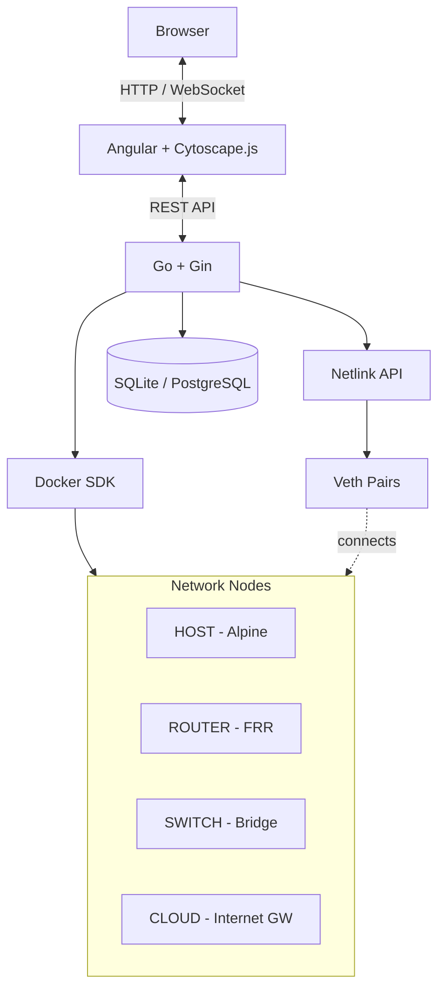

# OpenVeth

**OpenVeth** is a web-based network emulator that uses real Linux kernel networking (Namespaces, Veth pairs, Bridges) and Docker containers to create network topologies. Design, deploy, and interact with network nodes directly from your browser.


---

<p align="center">
  
</p>

<p align="center">
  <i>Create network topologies visually, connect to nodes via terminal, capture packets in real-time.</i>
</p>

---

## Features

| Feature | Description |
|---------|-------------|
| **Visual Topology Builder** | Drag-and-drop canvas (Cytoscape.js) to design network labs |
| **Integrated Terminals** | Shell access to any node (bash, vtysh) via xterm.js |
| **Live Packet Capture** | Wireshark-style traffic sniffing in real-time |
| **Dynamic Routing** | Full FRRouting support (OSPF, BGP, IS-IS, Static) |
| **SSH Between Nodes** | Connect from one node to another within the lab |
| **DHCP Server** | Automatic IP assignment for realistic LAN labs |
| **Infrastructure as Code** | Export/import topologies as YAML |
| **Lab Management** | Create, save, and switch between lab projects |
| **State Persistence** | IP configurations auto-saved every 30s and restored on lab activation |

---

## Node Types

| Type | Base Image | Use Case |
|------|------------|----------|
| **HOST** | Alpine Linux | End devices, servers, clients |
| **ROUTER** | FRRouting | Dynamic routing, NAT, firewalls |
| **SWITCH** | Linux Bridge | L2 switching, broadcast domains |
| **HUB** | Linux Bridge (no MAC learning) | L1 repeater, floods all traffic to all ports |
| **CLOUD** | Alpine Linux | Internet gateway, provides external connectivity via Docker bridge |

All nodes include: `iproute2`, `tcpdump`, `ping`, `traceroute`, `curl`, `iperf3`

---

## Quick Start

### Requirements

| Component | Version | Notes |
|-----------|---------|-------|
| Docker | 20.10+ | Required |
| Docker Compose | 2.0+ | Required |
| Make | - | Required |
| Linux / WSL2 | - | Netlink operations require Linux kernel |

> **Windows Users**: OpenVeth requires Linux networking. Use WSL2 with Docker Desktop configured for WSL integration.

### Installation

```bash
git clone https://github.com/RArielVillalobos/open-veth.git
cd open-veth
make up
```

That's it! The command will:
- Build node images (Host, Router)
- Auto-detect available ports (avoids conflicts with existing services)
- Start the application and show you the URL

```
========================================
  OpenVeth is running!
  Frontend: http://localhost:8080
  Backend:  http://localhost:8081
========================================
```

### Useful Commands

```bash
make help         # Show all available commands
make up           # Start OpenVeth (auto-detects ports)
make down         # Stop OpenVeth
make logs         # View container logs
make status       # Show current ports and container status
make reset-ports  # Force port re-detection on next start
```

### Development Setup

For local development (requires Go 1.23+ and Node.js 22+):

```bash
# Start dev container (provides Linux networking tools)
make dev-env

# In another terminal, enter the container
docker exec -it openveth-dev bash

# Inside the container, run the API
go run ./cmd/openveth-api

# Run frontend natively (terminal 2, on your host)
cd frontend && npm install && npm start
# → UI at http://localhost:4200
```

---

## Architecture

OpenVeth translates your visual topology into real Linux kernel networking structures.



### How it works

1. **Nodes** → Docker containers with isolated network namespaces (HOST, ROUTER, SWITCH, CLOUD)
2. **Links** → `veth` pairs connecting container namespaces
3. **SWITCH nodes** → Have a Linux bridge (`br0`) inside for L2 switching
4. **CLOUD nodes** → Keep `eth0` connected to the Docker bridge, providing internet access to the lab
5. **Startup reconciliation** → On restart, the backend rebuilds containers, links, and IP configs automatically from the database

---

## Why OpenVeth?

| Feature | OpenVeth | GNS3 | EVE-NG | Packet Tracer |
|---------|:--------:|:----:|:------:|:-------------:|
| Real Linux networking | ✅ | ✅ | ✅ | ❌ |
| Web-based UI | ✅ | ❌ | ✅ | ❌ |
| Low resource usage | ✅ | ❌ | ❌ | ✅ |
| No VMs required | ✅ | ❌ | ❌ | ✅ |
| Free & Open Source | ✅ | ✅ | ⚠️ | ❌ |
| FRRouting support | ✅ | ✅ | ✅ | ❌ |
| Live packet capture | ✅ | ✅ | ✅ | ❌ |
| SSH between nodes | ✅ | ✅ | ✅ | ❌ |

---

## Use Cases

- **Networking Courses**: Hands-on labs for CCNA, Network+, Linux networking
- **Protocol Analysis**: Capture and analyze OSPF, BGP, ARP, DHCP packets
- **Network Administration**: Practice SSH, remote management, and troubleshooting
- **Infrastructure Design**: Prototype topologies before production deployment

---

## Contributing

Contributions are welcome! Please follow these steps:

1. Fork the repository
2. Create your feature branch (`git checkout -b feature/amazing-feature`)
3. Commit your changes (`git commit -m 'Add amazing feature'`)
4. Push to the branch (`git push origin feature/amazing-feature`)
5. Open a Pull Request

---

## License

This project is licensed under the **GNU Affero General Public License v3 (AGPLv3)**.

See the [LICENSE](LICENSE) file for details.

---

<p align="center">
  Made with ❤️ for the networking community
</p>
