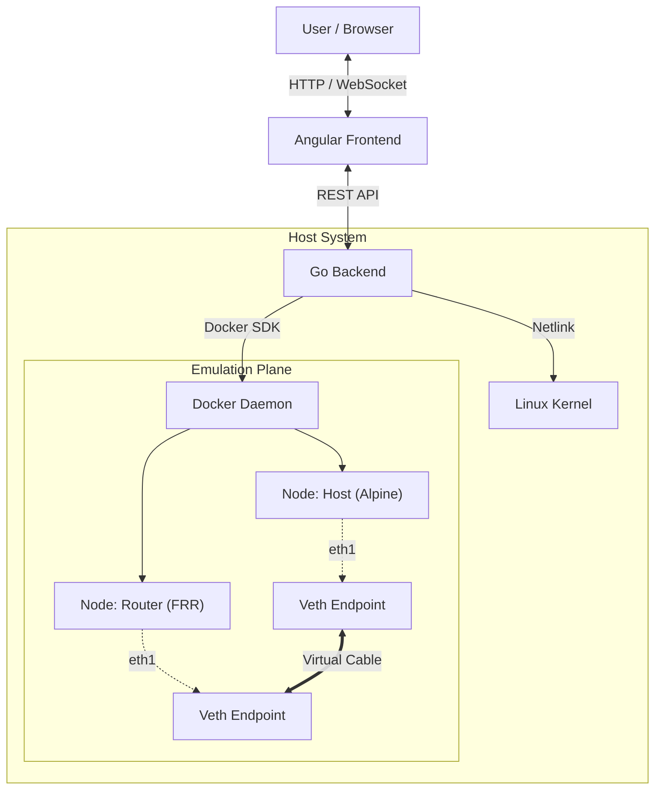

# OpenVeth

**OpenVeth** is a modern, high-performance network emulator that runs in your browser. It leverages native Linux networking (Namespaces, Veth pairs, Bridges) and Docker containers to emulate complex network topologies without the heavy overhead of traditional virtual machine-based emulators.


-orange)

---

<!-- 
TODO: Upload a screenshot of your dashboard to 'docs/screenshots/dashboard.png' 
or replace this link with a valid URL.
-->


> *Design, deploy, and interact with real network nodes directly from your browser.*

## 🚀 Key Features

*   **⚡ Lightweight & Fast:** Uses Docker containers instead of heavy VMs. Boot a 50-node topology in seconds.
*   **🎨 Visual Topology Builder:** Modern interactive canvas (Cytoscape.js) to design and manage your labs.
*   **💾 Infrastructure as Code:** Export your labs to YAML. Share topologies easily.
*   **🖥️ Integrated Terminals:** Professional shell access to nodes (sh, vtysh) powered by xterm.js directly in your browser.
*   **🧠 "Smart" Networking:** Automatically handles `veth` pairs creation, interface naming, and bridge management.
*   **🏢 Laboratory Management:** Create, save, and switch between different lab projects.

## 🛠️ Architecture

OpenVeth acts as an orchestrator that translates your visual design into real Linux kernel networking structures.



### How it works under the hood
1.  **Nodes** are lightweight Docker containers (Alpine Linux or FRRouting).
2.  **Links** are native Linux `veth` (Virtual Ethernet) pairs. One end is injected into Container A's namespace, the other into Container B's namespace.
3.  **Switches** are Linux Bridges (`br0`) inside a container, allowing standard L2 switching behavior.

## 🏁 Getting Started

### Prerequisites
*   **Docker** & **Docker Compose** installed.
*   **Linux Environment** (Native Linux or Windows WSL2 is required for Netlink operations).

### Quick Start

1.  **Initialize Infrastructure:**
    Start the development environment and build the node images.
    ```bash
    make dev-env    # Starts the dev container and DB
    make images     # Builds 'openveth/host' and 'openveth/router' images
    ```

2.  **Run the Backend (API):**
    ```bash
    make run-api
    ```
    *Server will start on `http://localhost:8080`*

3.  **Run the Frontend (UI):**
    Open a new terminal:
    ```bash
    make run-ui
    ```
    *Access the dashboard at `http://localhost:4200`*

## 🧪 Usage Examples

*   **Data Center Fabrics (BGP/EVPN):** Emulate complex Spine-Leaf topologies using FRRouting (FRR) containers with minimal CPU/RAM footprint.
*   **Network Automation Sandbox:** The perfect environment to test **Ansible** playbooks, Nornir scripts, or Go automation against a fleet of network nodes before production.
*   **Advanced Switching Labs:** Design and troubleshoot Layer 2 domains, bridge interactions, and ARP handling in a fully isolated environment.

## 🤝 Contributing

We welcome contributions! Feel free to open issues or pull requests to improve the project.

1.  Fork the project.
2.  Create your feature branch (`git checkout -b feature/AmazingFeature`).
3.  Commit your changes (`git commit -m 'Add some AmazingFeature'`).
4.  Push to the branch (`git push origin feature/AmazingFeature`).
5.  Open a Pull Request.

## 📄 License

This project is licensed under the GNU Affero General Public License v3 (AGPLv3). See the [LICENSE](LICENSE) file for details.